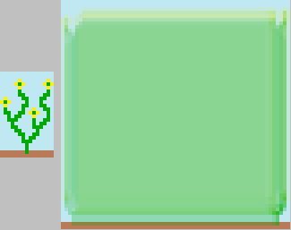
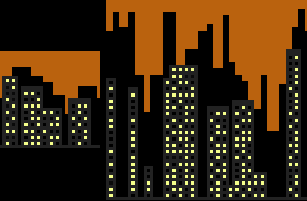

# libwfc

**This is a single-person project, please do not send pull requests to this repo.**

libwfc is a single-header C library for the Wave Function Collapse algorithm (WFC). It (currently) only covers the 2D overlapping model. WFC accepts a small reference image and outputs a larger image that resembles the input. See https://github.com/mxgmn/WaveFunctionCollapse for more details on the algorithm.

This project also offers a CLI and a rudimentary GUI tool for the WFC process.

`benchmark/` contains a benchmark test and results.



## How to use the library

You only need `wfc.h`. Include it like this:

```c
    #define WFC_IMPLEMENTATION
    #include "wfc.h"
```

Call `wfc_generate`:

```c
    wfc_generate(
        // pattern width and height, 3 is a good starting value
        n,
        // options to control WFC, 0 if you don't want to enable any
        wfc_optFlipH | wfc_optRotate | wfc_optEdgeFixV,
        // byte size of a single pixel value
        4,
        // dimensions and bytes of the input image
        srcW, srcH, (unsigned char*)src,
        // dimensions and bytes of the output image
        dstW, dstH, (unsigned char*)dst);
```

There are other functions and ways of running WFC, check out the giant comment near the start of `wfc.h` for instructions.

If you want to test the correctness of the library on your system, run `make test`.

## How to use the CLI/GUI

The library itself does not deal with file I/O nor with backtracking in case WFC runs into a contradiction. CLI and GUI both do.

Run `make` to build both tools.

Run the CLI with:

```
bin/cli external/samples/Angular.png -n 3 -w 64 -h 64 -o bin/gen.png
```

And the GUI with:

```
bin/gui external/samples/Angular.png -n 3 -w 64 -h 64 -o bin/gen.png
```

Simply run `bin/cli` or `bin/gui` to see the list of possible arguments.

GUI lets you watch WFC as it runs and you can pause/unpause it. You can also erase parts of the generated image and force WFC to generate them anew.



## Credits

Sample images were taken from https://github.com/mxgmn/WaveFunctionCollapse. See https://github.com/mxgmn/WaveFunctionCollapse#credits for more detailed attributions.

`stb_image.h` and `stb_image_write.h` come from https://github.com/nothings/stb.
